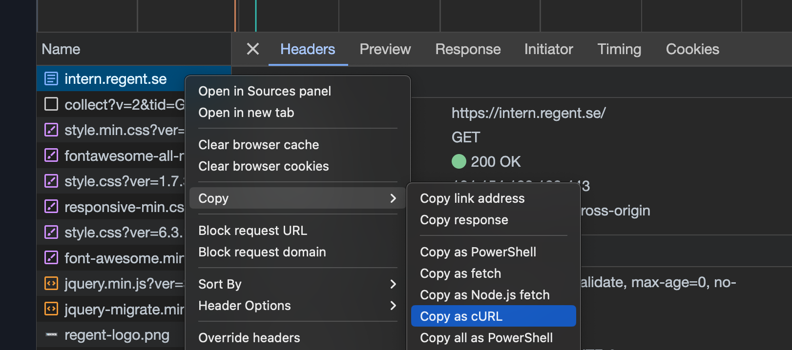

# Regent Rag

Regent Rag is a collection of Python scripts designed to scrape authenticated websites, transform the textual content into a vector database, and execute queries against this database.

This README provides instructions on how to install, setup and run the scripts locally.

## Installation

### For Windows Users

Installation on Windows might require a custom setup or WSDL. More details will be provided soon.

### Python

Install Python 3.12. You can download it from the [official Python website](https://www.python.org/downloads/) or if you're on MacOS using [pyenv](https://github.com/pyenv/pyenv#getting-pyenv).

### Pipenv

Install pipenv using the following command:

```bash
pip install --user pipenv
```

You can verify your installation by running:

```bash
pipenv --version
```

### Rust compiler

Ensure you have a rust compiler installed. It's required for `tiktoken` when running Python 3.12. You can install it (on MacOS) using the following command:

```bash
curl --proto '=https' --tlsv1.2 -sSf https://sh.rustup.rs | sh
```

You can verify your installation by running:

```bash
cargo --version
```

### Install packages

Install all packages (including dev dependencies) using the following command:

```bash
make install-dev
```

## Usage

### Environment Setup

#### How to create a `.env` file

Create a `.env` file with the keys listed in `.env.sample`:

```env
OPENAI_API_KEY=""
PINECONE_API_KEY=""
PINECONE_INDEX_NAME=""
PINECONE_ENVIRONMENT="gcp-starter"
LOG_LEVEL="INFO"
```

- `OPENAI_API_KEY`: This is your API key for OpenAI. It's used to authenticate your application with OpenAI's services. You can find them here: <https://platform.openai.com/account/api-keys>

- `PINECONE_API_KEY`: This is your API key for [Pinecone](https://app.pinecone.io/). It's used to authenticate your application with Pinecone's services.

- `PINECONE_INDEX_NAME`: This is the name of the index in Pinecone where your vectors will be stored.

- `PINECONE_ENVIRONMENT`: Used to specify the Pinecone environment in which your application is running. If you are using the free tier it should probably be set to `"gcp-starter"`.

- `LOG_LEVEL`: This sets the level of logging for the application. It can be set to different levels like `"INFO"`, `"DEBUG"`, `"ERROR"`, etc. depending on the amount of information you want to log. `"INFO"` is a standard level that will capture most of the important information without being too verbose.

#### How to create a `request.curl` file

You need to copy a request from the network tab of your browser in order to be able to scrape a webpage that requires authentication.

##### Steps

1. Open the webpage you want to scrape in Google Chrome.
1. Press F12 to open the Developer Tools.
1. Click on the Network tab.
1. Refresh the webpage to start capturing the requests.
1. Look for a request towards the domain of the webpage you want to scrape.
1. Make sure the request contains the necessary cookies for authentication. These are usually found in the Headers section of the request.
1. Right-click on the request and select Copy -> Copy as cURL.
1. Paste the copied request into a new file and save it as `request.curl`.



By following these steps, you'll have a `request.curl` file that contains all the necessary cookies for the scraper to work with authentication.

### Running the scripts

#### Scraping

`make scrape`

#### Creating chunks

`make chunks`

#### Create vectors and upload to pinecone

`make vectors`

#### Query the vector db

`make query`

## References

<https://github.com/Sstobo/Site-Sn33k>
